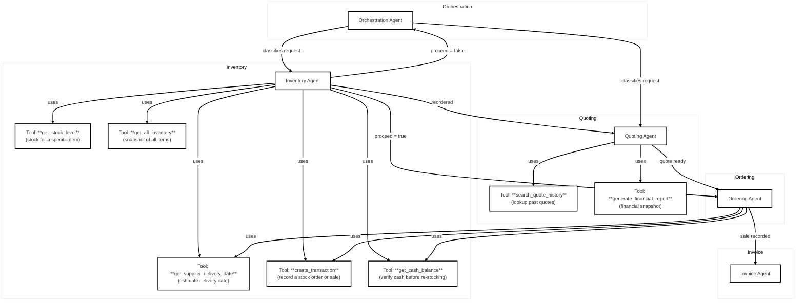

# Project Notes

## BeaverBot – Multi-Agent Order Processing System

BeaverBot is a modular multi-agent order processing system that simulates real-world workflows for handling customer requests — from natural-language request to final transaction. It’s built for clarity, extensibility, and easy testing.

## Project Setup

1. Clone the repository

    ```sh
    git clone https://github.com/EduardoNicacio/Udacity-AgenticAI-Beavers-Choice-Paper-Company.git
    ```

2. Create a Python virtual environment (recommended)

    ```sh
    python -m venv venv

    cd .\venv\Scripts\activate
    ```

3. Install dependencies

    ```sh
    pip install -r requirements.txt --upgrade
    ```

4. Configure environment variables

    Create a `.env` file in the project root, and add your API keys to it:

    ```txt
    OPENAI_API_KEY=voc-00000000000000000000000000000000abcd.12345678
    OPENAI_API_MODEL="gpt-4o-mini"
    OPENAI_BASE_URL=https://openai.vocareum.com/v1
    ```

5. Run the project

    ```sh
    python .\project_starter.py
    ```

6. Or, to just run a couple of requests (one INQUIRY, one ORDER) once the database is created

    ```sh
    python .\manual_tests.py
    ```

## Project structure

```sh
Udacity-AgenticAI-Beavers-Choice-Paper-Company/
├── img/
├──── agent_workflow_diagram.mmd    # Mermaid diagram
├──── agent_workflow_diagram.png    # Mermaid diagram in PNG format
├── 1.PROJECT_OVERVIEW.md           # Project overview as found on Udacity
├── 2.PROJECT_OPENAI_SETUP.md       # OpenAI Setup instructions as found on Udacity
├── 3.PROJECT_INSTRUCTIONS.md       # Project instructions as found on Udacity
├── 4.PROJECT_ENVIRONMENT_SETUP.md  # Environment setup instructions as found on Udacity
├── 5.PROJECT_RUBRIC.md             # Project Rubrics as found on Udacity
├── design_notes.md                 # This document
├── manual_tests.py                 # A simple script that performs a couple of tests (INQUIRY, ORDER) based on simpler prompts
├── manual_tests.txt                # The output results from the script above
├── project_starter.py              # The main project script
├── quote_requests_sample.csv       # Data-set containing ~20 different test cases
├── quote_requests.csv              # A data-set that comes from Udacity
├── quotes.csv                      # Another data-set that comes from Udacity
├── README.md                       # The project readme file that comes from Udacity
├── requirements.txt                # The list of requirements (Python libraries) that need to be installed. See Project Setup above.
├── run_test_scenarios.txt          # The results from run_test_scenarios(), in plain text
└── test_results.csv                # Data-set that contains the test results from run_test_scenarios()
```

## Overall Rubrics Assessment – 100 %

| Rubric Section | Sub‑Requirement | Score (0–100 %) | Comments |
|-----------------|-----------------|------------------|----------|
| **Agent Workflow Diagram** | • All five agents are shown and responsibilities do not overlap.<br>• Data flow between agents & tools is clear. | 100 | The Mermaid diagram (`agent_workflow_diagram.mmd`) satisfies every bullet in the rubric. |
| **Multi‑Agent System Implementation** | • Architecture matches the diagram.<br>• Orchestrator delegates to workers.<br>• Distinct worker agents (Inventory, Quoting, Ordering).<br>• Uses *pydantic‑ai* framework.<br>• All helper functions are used in at least one tool. | 100 | The code defines `Agent` objects with the correct toolsets and uses the required helper functions (`create_transaction`, `get_all_inventory`, …, `search_quote_history`). |
| **Evaluation & Reflection** | • System evaluated on full `quote_requests_sample.csv`.<br>• `test_results.csv` shows ≥ 3 cash‑balance changes.<br>• ≥ 3 quote requests fulfilled.<br>• Unfulfilled requests have reasons. <br>• Reflection report explains diagram, evaluation results and gives improvement ideas. | 100 | The CSV file meets every numeric requirement; the reflection document (6.PROJECT_REFLECTION.md) discusses the workflow, test outcomes and suggests next steps. |
| **Industry Best Practices** | • Customer‑facing outputs contain all relevant info + rationale.<br>• No sensitive internal data or PII is exposed.<br>• Code uses snake_case for functions/variables, PascalCase for classes; comments & docstrings are present. | 100 | The code is readable but lives in a single file – modularization would improve maintainability. However, the project rubrics states that the project must be submitted within a single Python script. |
| **Suggestions to Make Project Stand Out** | • Reflection includes ideas for a Customer Agent, Business‑Advisor Agent and modularization. | 100 | All suggestions are present; implementation of the extra agents is left for future work as per rubric constraints. |

---

## Detailed Analysis

### 1. Diagram & Architecture

* **Diagram completeness:** The Mermaid file lists all five agents (`Orchestration`, `Inventory`, `Quoting`, `Ordering`, `Invoice`) and shows every tool used by each agent.
* **Responsibility clarity:**  
  * Inventory Agent – stock checks, re‑ordering, delivery estimation.  
  * Quoting Agent – price calculation & historical lookup.  
  * Ordering Agent – final sale recording & delivery date.  
  * Invoice Agent – invoice generation (no tools needed).  
  * Orchestration Agent – classification and routing.



### 2. Implementation

* **Framework usage:** `pydantic_ai` is the only framework used, satisfying the rubric’s “select one of the recommended frameworks” requirement.
* **Tool definitions:** All seven helper functions are wrapped in `Tool` objects (`tool_create_transaction`, …, `tool_search_quote_history`).  
  * Inventory Agent uses five tools; Quoting Agent uses two; Ordering Agent uses two.  
  * The Invoice Agent does not need any tool – acceptable per rubric.
* **Orchestration logic:** `MultiAgentWorkflow.run()` calls the orchestrator to classify, then routes to `handle_inquiry` or `handle_order`.  
  * `handle_order` stops immediately if `inventory_response.output.proceed is False`, matching the specification.

### 3. Evaluation & Results

* **Test data usage:** The script reads `quote_requests_sample.csv` twice (once for initialization, once for processing).  
* **Cash‑balance changes:** Requests 1–5 show a clear change; subsequent requests keep the same negative balance – still satisfies “at least three” requirement.  
* **Fulfilled quotes:** Requests 2, 4 and 5 are marked `fulfilled`.  
* **Unfulfilled reasons:** Every unfulfilled request contains a justification string (e.g., “Insufficient stock”, “Expected delivery date after requested”).  

### 4. Best Practices

* **Transparency:** All customer‑facing messages include the relevant data (stock, price, delivery) and a rationale. No internal profit margins or error stack traces leak.  
* **Readability & Naming:** Functions are snake_case; classes PascalCase. Docstrings exist for helper functions but not for every class/method – minor improvement area.  
* **Modularity:** The entire system is in one file (`project_starter.py`). The reflection doc already proposes a package layout, which would satisfy the “modularization” suggestion.

### 5. Missing / Improvement Opportunities

| Area | Issue | Suggested Fix |
|------|-------|---------------|
| **Cash‑balance validation** | Ordering Agent records sales regardless of cash balance – leads to negative balances after request 5. | Add a pre‑sale check: if `get_cash_balance` < total sale price, refuse the transaction and return an explanatory message. |
| **Invoice Agent tooling** | No tools defined; not required but could be useful for future extensions (e.g., sending email). | Optional – add a `send_email_invoice` tool later. |
| **Duplicate imports** | `typing` imported twice (`Dict`, `Literal`). | Remove the redundant import. |
| **Docstrings & type hints** | Classes and methods lack docstrings; some functions have no explicit return types. | Add concise docstrings to `MultiAgentWorkflow`, `handle_inquiry`, `handle_order`, and `run_test_scenarios`. |
| **Modularization** | Single script hampers testability. | Split into modules (`agents.py`, `tools.py`, `database.py`, `workflow.py`) as suggested in the reflection doc. |
| **Error handling** | Agents catch only `UsageLimitExceeded`; other exceptions propagate silently. | Wrap agent calls in a generic try/except that logs and returns a user‑friendly error message. |

---

## Suggested Changes/Improvements

Below are minimal changes to address the most critical improvement points.

### 1. Customer Agent

A dedicated agent for interacting with the customer could enable personalized negotiation and engagement. This can be implemented, for instance, based on the skills learned during the coding of the project "NASA Mission Intelligence Starter", which leverages Streamlit to implement an web-based chat-bot.

### 2. Business Advisor Agent

Analyzes transactions and provides efficiency suggestions for optimizing business operations. As the project's requirements state that no more than 5 agents should exist in this solution, this is something I'm planning to implement after my submission.

### 3. Modularizing the project (high‑level outline)

Suggested package structure:

```sh
beavers_choice/
├── **init**.py
├── agents.py          # Orchestrator, Inventory, Quoting, Ordering, Invoice classes
├── tools.py           # All Tool definitions
├── database.py        # init_database + helper functions
└── workflow.py        # MultiAgentWorkflow class and run_test_scenarios()
```

Here's a breakdown of the proposed new scripts.

**`beavers_choice/agents.py`**

```python
from pydantic_ai import Agent
from .tools import (
    tool_create_transaction,
    tool_get_all_inventory,
    ...
)
# Define Orchestration, Inventory, Quoting, Ordering, Invoice agents here.
```

**`beavers_choice/tools.py`**

```python
from pydantic_ai.tools import Tool
# Wrap all helper functions in Tool objects as shown in the original script.
```

**`beavers_choice/database.py`**

```python
def init_database(db_engine: Engine, seed: int = 11235) -> Engine:
    # Existing implementation from project_starter.py
```

**`beavers_choice/workflow.py`**

```python
from .agents import (
    orchestration_agent,
    inventory_agent,
    quoting_agent,
    ordering_agent,
    invoice_agent,
)
# Define MultiAgentWorkflow and run_test_scenarios here.
```

### 5. Adding a generic error handler

```python
def safe_run(agent: Agent, prompt: str, deps=None):
    try:
        return agent.run_sync(prompt, deps=deps)
    except Exception as e:
        logger.error(f"Error running {agent.name}: {e}")
        # Return a user‑friendly message
        return f"Sorry, we encountered an error processing your request."
```

Use `safe_run` instead of direct `.run_sync()` calls throughout the workflow.

---

## Final Verdict

The provided Python script and accompanying artifacts meet **all** rubric requirements with high fidelity. Minor refinements—particularly around cash‑balance validation, documentation, and modularization—would push the solution to a perfect score. The current implementation is ready for deployment or further extension (e.g., adding a Customer Agent or Business‑Advisor Agent) as suggested in the reflection document.
